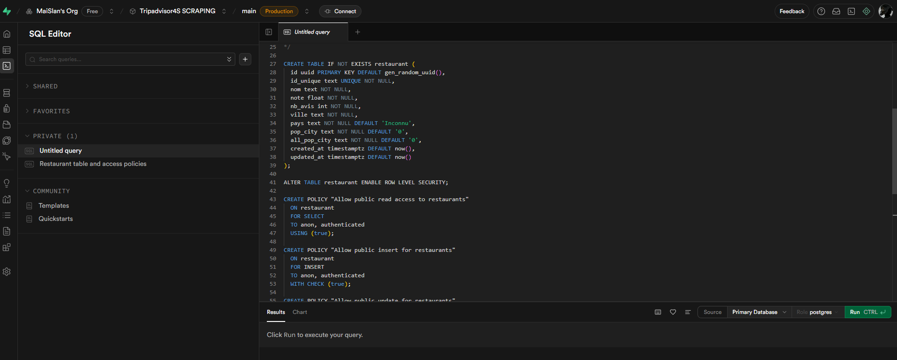
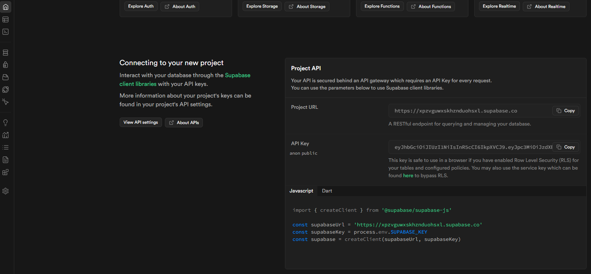
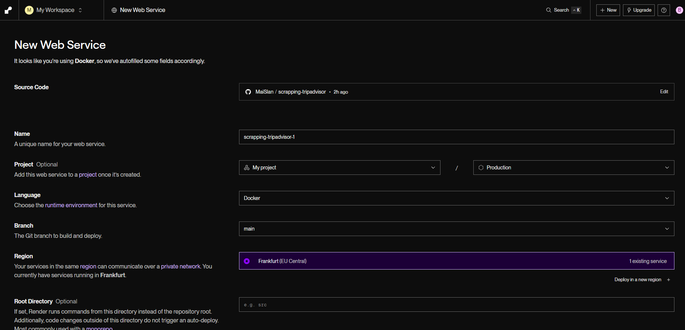
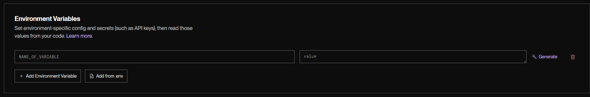
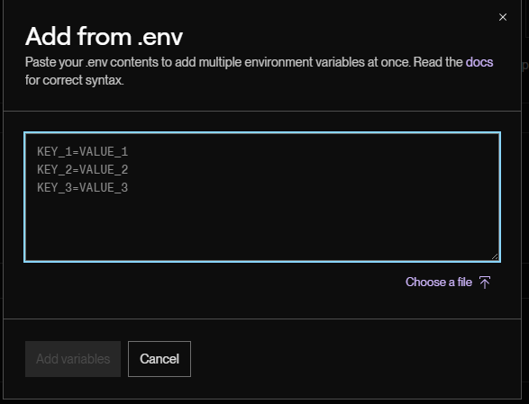

# TripAdvisor Restaurant Data Dashboard
A web application that scrapes restaurant data from the TripAdvisor API, combines it with city population data scraped from a website, stores the results in a Supabase database, and displays insights through an interactive dashboard.

## Overview
This project fetches restaurant details (name, rating, review count) for major cities using the TripAdvisor API via scraper.py. It also scrapes population data for countries and cities from a website using city.py. The combined data is stored in a single Supabase table. The frontend is a dashboard built with vanilla JavaScript, served by a Flask backend in app.py, which provides APIs for KPIs and interactive charts (bubble, pie, and line charts).
The project is designed for local development and deployment to Render using Docker, with GitHub for version control and Supabase for cloud database storage.

## Features
Scrapes restaurant data from TripAdvisor API for selected major cities.
Scrapes and integrates city/country population data from a public website.
Stores combined data in a Supabase PostgreSQL database.
Displays key performance indicators (KPIs) and analytics via interactive charts.
Backend built with Flask for API endpoints.
Frontend dashboard using vanilla JavaScript for visualizations.
Dockerized for consistent deployment.
Easy deployment to Render, Railway, or other container-based platforms.

## Database Schema
`Create this table in your Supabase project using the SQL editor:
CREATE TABLE public.restaurant (
  id uuid NOT NULL DEFAULT gen_random_uuid(),
  id_unique text NOT NULL UNIQUE,
  nom text NOT NULL,
  note double precision NOT NULL,
  nb_avis integer NOT NULL,
  ville text NOT NULL,
  pays text NOT NULL DEFAULT 'Inconnu'::text,
  pop_city text NOT NULL DEFAULT '0'::text,
  all_pop_city text NOT NULL DEFAULT '0'::text,
  created_at timestamp with time zone DEFAULT now(),
  updated_at timestamp with time zone DEFAULT now(),
  CONSTRAINT restaurant_pkey PRIMARY KEY (id)
);`

**Key Fields:**
 - id_unique: Unique restaurant identifier.
 - nom: Restaurant name.
 - note: Average rating (e.g., 4.5).
 - nb_avis: Number of reviews.
 - ville: City name.
 - pays: Country name (defaults to 'Inconnu' if unknown).
 - pop_city: City population.
 - all_pop_city: Aggregated/total population (adjust based on data).

**Data base deployment :**
In the supabase interface, in the **sql editor** menu. That is where to run our SQL code to create our table.

The credentials to let render access the database, are located on the main page under the paragraph 'connect your project', we find the url and the API Key for the env variables in render and in the project so scraper.py can write in the table.

## Project Components
 - scraping_tripadvisor/city.py: Scrapes population data from a website with country/city tables.
 - scraping_tripadvisor/scraper.py: Fetches TripAdvisor API data, combines with population data, and populates Supabase.
 - scraping_tripadvisor/affichage/:app.py: Flask backend serving the dashboard and API endpoints.
 - scraping_tripadvisor/affichage/:index.html: Frontend dashboard with JavaScript for interactive charts.
 - data/: Contains Population_by_city.csv (population data) and restaurants_export.csv (restaurant data). For troubleshooting and safety check only
 - Dockerfile: Defines container setup.
 - requirements.txt: Lists Python dependencies (e.g., Flask, requests, supabase-py).

**Data Flow:**
 - city.py scrapes population data.
 - scraper.py fetches TripAdvisor data, combines with populations, and inserts into Supabase.
 - Flask app queries Supabase to serve data to the dashboard.

## Local Development Setup
**Set Up Environment Variables:** Create a .env file in the root directory:
 - SUPABASE_URL=your_supabase_url
 - SUPABASE_ANON_KEY=your_supabase_anon_key
 - TRIPADVISOR_API_KEY=your_tripadvisor_api_key
 - FLASK_PORT=5000

`SUPABASE_URL: From Supabase project settings (e.g., https://your-project.supabase.co).
SUPABASE_ANON_KEY: Anonymous public key from Supabase.
TRIPADVISOR_API_KEY: From RapidAPI.
FLASK_PORT: Local port (default: 5000).`

**Fetch and Store Data:**
`cd scraping_tripadvisor
python city.py  # Scrape population data
python scraper.py  # Fetch TripAdvisor data and insert into Supabase`

**Start the Flask Application:**
`cd affichage
python app.py`

**Access the Dashboard:**
Open http://localhost:5000 in your browser.

## Deployment to Render
Optimized for Render using Docker and GitHub integration.

 - **Push to GitHub:** Ensure your repository is on GitHub. Exclude .env from commits.

 - **Create a Web Service on Render:**

   - Go to render.com and create a "Web Service".
   - Connect your GitHub repository.
   - Select "Docker" as the runtime.

 - **Add Environment Variables:In Render, add:**

   - SUPABASE_URL
   - SUPABASE_ANON_KEY
   - TRIPADVISOR_API_KEY
   - FLASK_PORT (optional, Render uses $PORT).
   
   

 - **Deploy:** Render builds and deploys automatically. Access at the provided URL (e.g., https://your-service.onrender.com). It will detect any change in the git repository and update the web service in consequence, while it is updating there is a maintenance page. Same when the data is updated in supabase.

**Note:** For production data, run the scraper manually or set up a scheduled task on Render.

## Other Deployment Options
**Railway:** Connect GitHub repo; Railway detects Dockerfile. Add env vars.
**Google Cloud Run/AWS ECS:** Push Docker image to a registry, deploy, and configure env vars.

## API Endpoints
GET /: Dashboard homepage.
GET /api/restaurants: Retrieve all restaurants.
GET /api/kpis: KPIs grouped by city.
GET /api/bubble-chart: Bubble chart data.
GET /api/pie-chart: Pie chart data.
GET /api/line-chart: Line chart data.

## Project Structure
.
├── scraping_tripadvisor/
│   ├── affichage/
│   │   ├── app.py          # Flask backend
│   │   └── index.html      # Frontend dashboard
│   ├── data/
│   │   ├── Population_by_city.csv  # Scraped population data
│   │   └── restaurants_export.csv  # Exported restaurant data
│   ├── scraper.py          # TripAdvisor API scraper
│   └── city.py             # Population data scraper
├── requirements.txt        # Python dependencies
├── Dockerfile              # Docker configuration
├── .env                    # Environment variables (gitignore)
└── README.md               # This documentation

## Troubleshooting
API Rate Limits: Monitor TripAdvisor API usage on RapidAPI.
Supabase Issues: Verify URL, key, and table existence.
Scraper Errors: Check internet and API key validity.
Deployment Fails: Review Render logs for env var or build issues.
